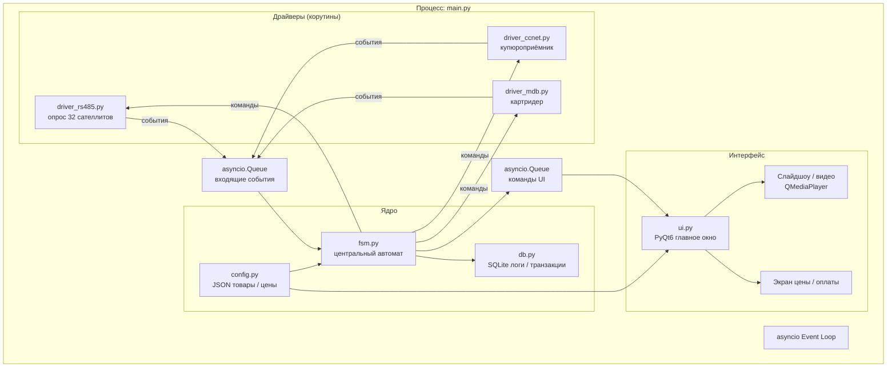
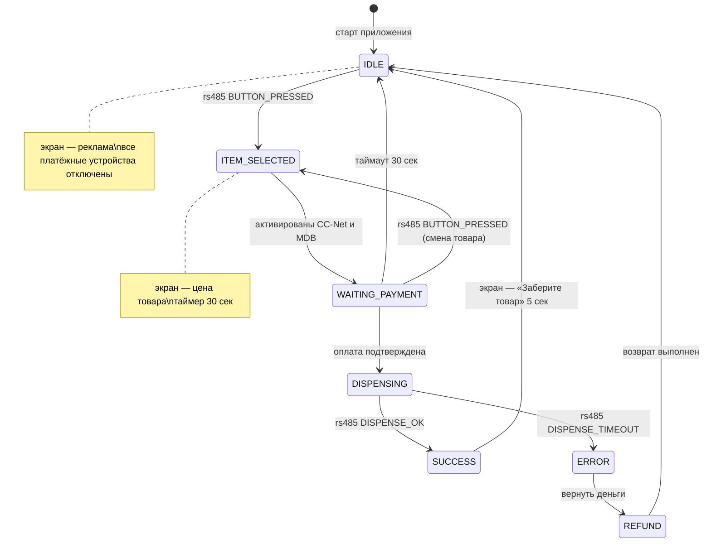
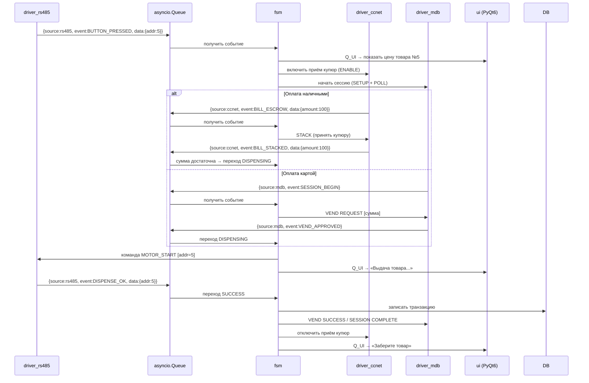
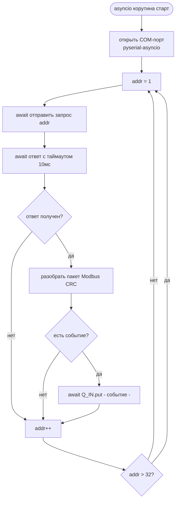

# Центральное ПО управляющего компьютера

## Стек

- **Язык:** Python 3.11+
- **Асинхронность:** asyncio + asyncio.Queue
- **COM-порты:** pyserial-asyncio
- **UI:** PyQt6 + QMediaPlayer
- **БД:** SQLite (встроенный sqlite3)
- **Конфигурация:** JSON

---

## Структура модулей



---

## Типы событий в очереди

Все драйверы кладут в `Q_IN` унифицированные события одного формата:

```python
{
    "source": "rs485" | "ccnet" | "mdb",
    "event":  "BUTTON_PRESSED" | "BILL_ESCROW" | ...,
    "data":   { ... }  # зависит от события
}
```

| source | event | data | Описание |
|--------|-------|------|----------|
| `rs485` | `BUTTON_PRESSED` | `{"addr": 5}` | Нажата кнопка на сателлите №5 |
| `rs485` | `DISPENSE_OK` | `{"addr": 5}` | Детектор выдачи сработал |
| `rs485` | `DISPENSE_TIMEOUT` | `{"addr": 5}` | Мотор крутился, товар не вышел |
| `ccnet` | `BILL_ESCROW` | `{"amount": 100}` | Купюра на удержании |
| `ccnet` | `BILL_STACKED` | `{"amount": 100}` | Купюра принята |
| `ccnet` | `BILL_RETURNED` | `{}` | Купюра отклонена |
| `mdb` | `SESSION_BEGIN` | `{}` | Карта приложена |
| `mdb` | `VEND_APPROVED` | `{"amount": 150}` | Оплата картой одобрена |
| `mdb` | `VEND_DENIED` | `{}` | Оплата отклонена |

---

## Конечный автомат (FSM)



---

## Взаимодействие корутин через очередь



---

## Драйвер RS-485 — логика опроса

Драйвер работает в бесконечном цикле, опрашивая все 32 адреса. При обнаружении события кладёт его в очередь.



---

## Структура файлов проекта

```
vending/
├── main.py                  # точка входа, запуск asyncio loop + PyQt6
├── config.json              # товары, цены, адреса сателлитов
├── fsm.py                   # конечный автомат
├── db.py                    # работа с SQLite
├── drivers/
│   ├── driver_rs485.py      # корутина опроса сателлитов
│   ├── driver_ccnet.py      # корутина CC-Net
│   └── driver_mdb.py        # корутина MDB
├── ui/
│   ├── ui.py                # главное окно PyQt6
│   ├── screen_idle.py       # экран рекламы
│   ├── screen_price.py      # экран цены / оплаты
│   └── screen_dispense.py   # экран выдачи / ошибки
└── media/
    └── ...                  # изображения и видео товаров
```

---

## Запуск asyncio и PyQt6 совместно

PyQt6 имеет собственный event loop, asyncio — свой. Для совместной работы используется `qasync`:

```python
# main.py
import asyncio
import qasync
from PyQt6.QtWidgets import QApplication
from ui.ui import MainWindow
from fsm import FSM

async def main():
    fsm = FSM()
    await asyncio.gather(
        fsm.run(),               # центральный автомат
        fsm.rs485.run(),         # корутина RS-485
        fsm.ccnet.run(),         # корутина CC-Net
        fsm.mdb.run(),           # корутина MDB
    )

app = QApplication([])
loop = qasync.QEventLoop(app)
asyncio.set_event_loop(loop)
with loop:
    loop.run_until_complete(main())
```

---

## Формат config.json

```json
{
  "items": [
    {
      "addr": 1,
      "name": "Игрушка A",
      "price": 150,
      "image": "media/toy_a.jpg",
      "motor_direction": "forward"
    },
    {
      "addr": 2,
      "name": "Игрушка B",
      "price": 200,
      "image": "media/toy_b.jpg",
      "motor_direction": "reverse"
    }
  ],
  "ports": {
    "rs485": "COM3",
    "ccnet": "COM4",
    "mdb":   "COM5"
  },
  "timeouts": {
    "payment_sec": 30,
    "dispense_sec": 10,
    "success_screen_sec": 5
  }
}
```

---

## Зависимости проекта

```
pyserial-asyncio==0.6
PyQt6==6.7.0
qasync==0.27.1
```
