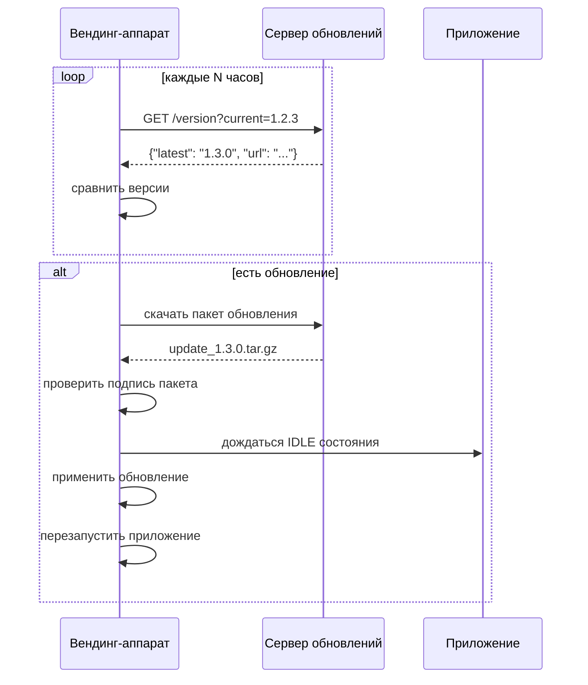
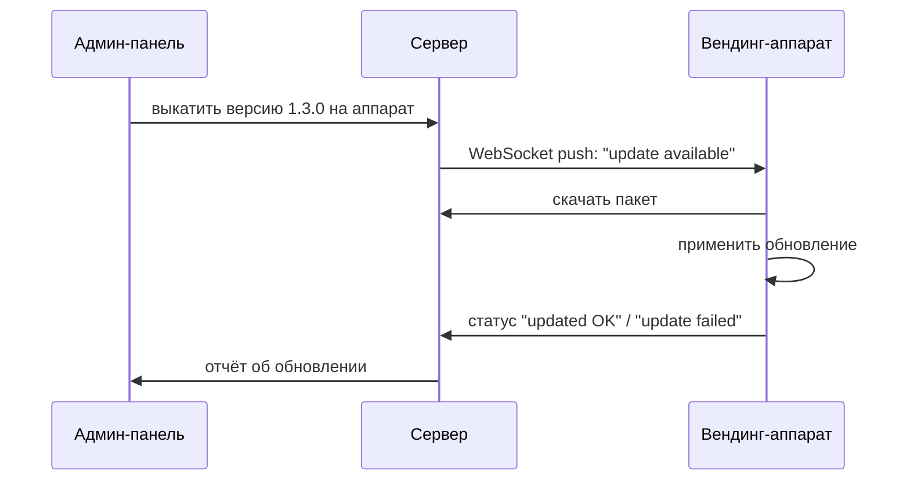
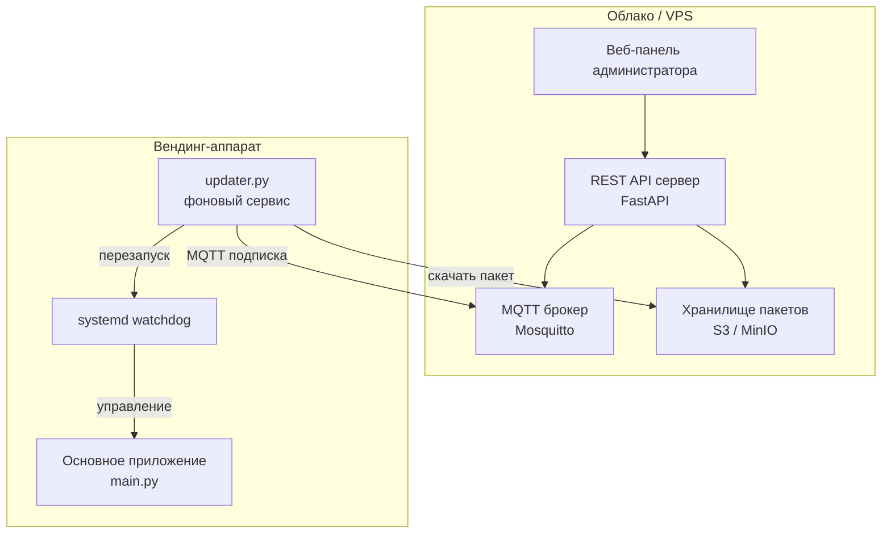
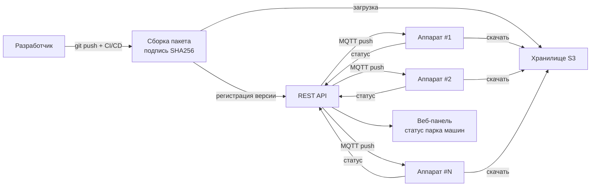

# Обновление ПО через интернет

## Ключевые требования

- Аппарат работает 24/7 — обновление не должно прерывать продажи надолго
- Аппаратов может быть несколько — нужно обновлять парк машин
- Нельзя оставить аппарат в сломанном состоянии после неудачного обновления
- Интернет может быть нестабильным (4G роутер в торговом центре)

---

## Варианты доставки обновлений

### 1. Pull-модель — аппарат сам проверяет обновления



**Плюсы:** просто реализовать, аппарат сам контролирует момент обновления
**Минусы:** нельзя принудительно обновить срочно

---

### 2. Push-модель — сервер инициирует обновление



**Плюсы:** мгновенное обновление по команде, контроль над парком машин
**Минусы:** нужен постоянный WebSocket/MQTT канал

---

## Рекомендуемая архитектура: Pull + MQTT

Оптимально совместить оба подхода — аппарат держит лёгкое MQTT-соединение с сервером, через которое получает команды, а пакеты скачивает сам по HTTPS.



---

## Процесс безопасного обновления

Ключевое требование — **откат при сбое**. Реализуется через A/B схему директорий:

```mermaid
flowchart TD
    START([MQTT: update available]) --> IDLE{аппарат\nв состоянии IDLE?}
    IDLE -->|нет, идёт продажа| WAIT[ждать завершения\nтекущей транзакции]
    WAIT --> IDLE
    IDLE -->|да| DOWNLOAD[скачать пакет по HTTPS]
    DOWNLOAD --> VERIFY{проверить\nподпись SHA256}
    VERIFY -->|не совпала| ABORT[отмена\nсообщить серверу]
    VERIFY -->|ок| UNPACK[распаковать в /app_new]
    UNPACK --> STOP[остановить main.py]
    STOP --> SWAP[переименовать\n/app → /app_old\n/app_new → /app]
    SWAP --> START_APP[запустить main.py]
    START_APP --> HEALTH{приложение\nзапустилось\nза 30 сек?}
    HEALTH -->|да| CONFIRM[удалить /app_old\nсообщить серверу OK]
    HEALTH -->|нет| ROLLBACK[/app → /app_bad\n/app_old → /app\nперезапустить]
    ROLLBACK --> REPORT[сообщить серверу FAILED]
```

---

## Что обновляется

| Тип обновления | Содержимое | Требует перезапуска |
|---------------|-----------|-------------------|
| Полное обновление ПО | `*.py` файлы, зависимости | да |
| Медиаконтент | `media/*.jpg`, `media/*.mp4` | нет, горячая замена |
| Конфигурация | `config.json` | нет, перечитывается на лету |
| Прошивка сателлита | `firmware.hex` → через RS-485 bootloader | нет |

---

## Минимальный updater.py

```python
import asyncio, hashlib, tarfile, os, aiohttp, asyncio_mqtt

MQTT_HOST = "mqtt.example.com"
UPDATE_URL = "https://updates.example.com"
APP_DIR    = "/opt/vending/app"

async def run(fsm_state: asyncio.Queue):
    async with asyncio_mqtt.Client(MQTT_HOST) as client:
        await client.subscribe("vending/{id}/update")
        async for msg in client.messages:
            payload = json.loads(msg.payload)
            await apply_update(payload, fsm_state)

async def apply_update(payload, fsm_state):
    # ждём IDLE
    while fsm_state.get_nowait() != "IDLE":
        await asyncio.sleep(5)

    # скачиваем и проверяем
    async with aiohttp.ClientSession() as s:
        async with s.get(payload["url"]) as r:
            data = await r.read()

    if hashlib.sha256(data).hexdigest() != payload["sha256"]:
        return  # подпись не совпала

    # A/B swap
    with tarfile.open(fileobj=io.BytesIO(data)) as t:
        t.extractall("/opt/vending/app_new")

    os.rename(APP_DIR, APP_DIR + "_old")
    os.rename(APP_DIR + "_new", APP_DIR)
    os.kill(os.getpid(), signal.SIGTERM)  # systemd перезапустит
```

---

## Systemd — автозапуск и watchdog

```ini
# /etc/systemd/system/vending.service
[Unit]
Description=Vending Machine App
After=network.target mosquitto.service

[Service]
WorkingDirectory=/opt/vending/app
ExecStart=/usr/bin/python3 main.py
Restart=always
RestartSec=5
WatchdogSec=60

[Install]
WantedBy=multi-user.target
```

Если приложение зависло и не отвечает watchdog за 60 секунд — systemd перезапустит его автоматически.

---

## Итоговая схема всей системы обновлений



Такая схема позволяет обновлять весь парк аппаратов одной кнопкой из веб-панели, с откатом при сбое и без потери транзакций.
