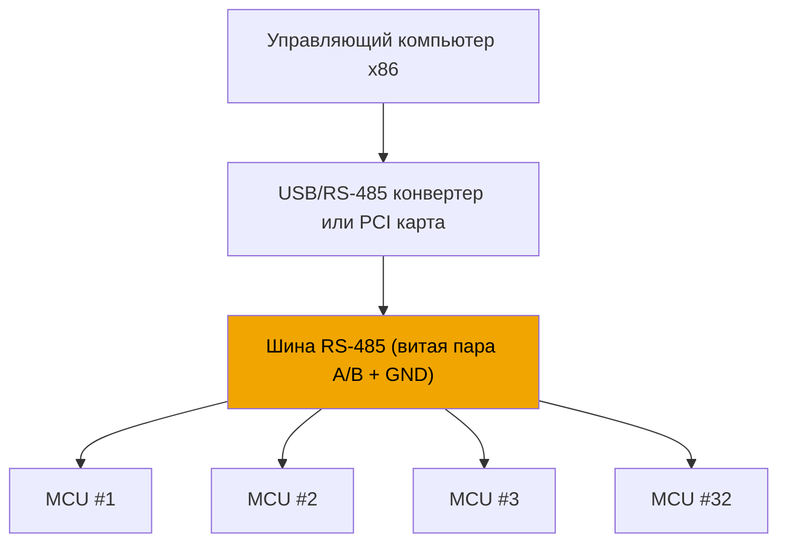
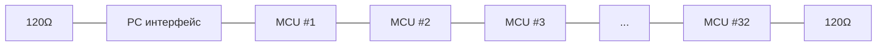
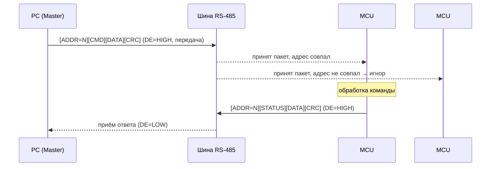
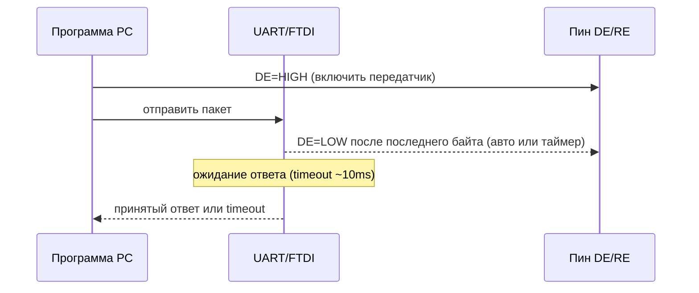
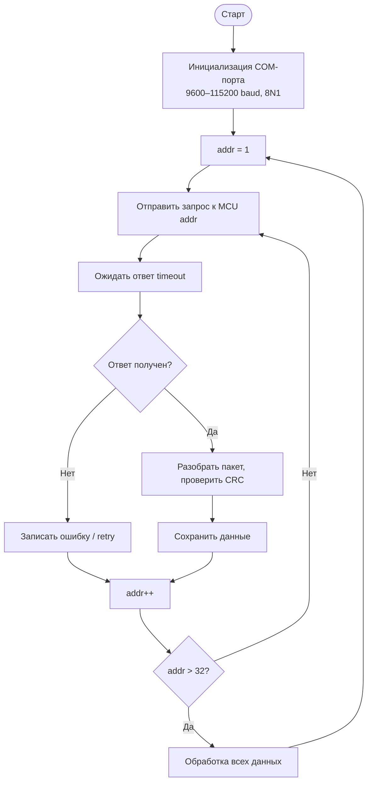

# Схема взаимодействия PC (x86) с 32 микроконтроллерами по RS-485

## Физический уровень

RS-485 — полудуплексная шина с дифференциальной передачей сигнала. Один мастер (PC) управляет 32 слейвами (MCU).

---

## Топология шины

Все устройства подключены параллельно к одной паре проводов. На концах шины — терминирующие резисторы 120 Ом.

---

## Протокол обмена (Master-Slave)

PC всегда инициирует обмен. MCU отвечают только при обращении к их адресу.

---

## Структура пакета

| Байт | Поле | Описание |
|------|------|----------|
| 1 | `ADDR` | Адрес слейва (1–32), 0 = broadcast |
| 2 | `CMD` | Код команды |
| 3–N | `DATA` | Полезная нагрузка |
| N+1, N+2 | `CRC16` | Контрольная сумма (Modbus CRC) |

---

## Управление направлением передачи (DE/RE)

RS-485 — полудуплекс, поэтому критично управление пином **DE/RE** драйвера.

> На практике используют **RTS** пин COM-порта или автоматическое управление DE в конвертерах типа **FTDI FT232R**, **MAX485**, **SP3485**.

---

## Алгоритм опроса 32 устройств (polling loop)

---

## Временные характеристики

При **9600 baud**, пакет 8 байт передаётся за ~8 мс. Полный опрос 32 устройств:

| Параметр | Значение |
|----------|----------|
| Скорость | 9600 baud |
| Пакет запроса | 8 байт → ~8 мс |
| Пакет ответа | 8 байт → ~8 мс |
| Timeout на слейв | 10 мс |
| Один цикл опроса | ~(8+8+10) × 32 ≈ **832 мс** |
| При 115200 baud | ~(1+1+2) × 32 ≈ **128 мс** |

---

## Рекомендации

- Использовать **Modbus RTU** как готовый стандарт поверх RS-485 — не изобретать велосипед
- Длина шины до **1200 м** при 9600 baud, до **100 м** при 115200 baud
- Обязательно **согласовывать шину** резисторами 120 Ом на обоих концах
- Адреса слейвов задавать через **DIP-переключатели** или при инициализации по EEPROM
- Реализовать **retry логику** (3 попытки) перед фиксацией ошибки устройства
