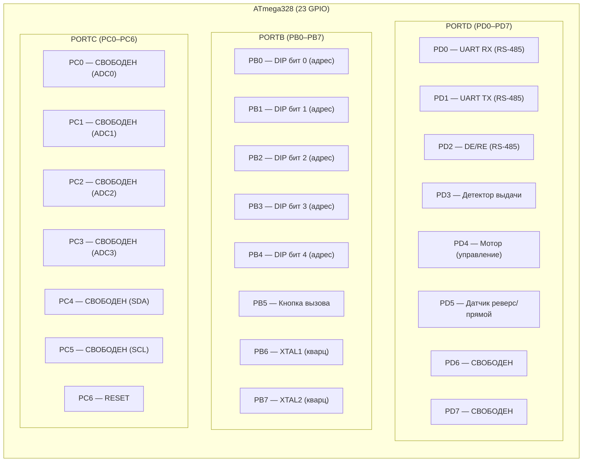

# Конечное устройство (сателлит) на базе ATmega328

## Подсчёт пинов ATmega328

ATmega328 имеет **23 GPIO** (PB0–PB7, PC0–PC6, PD0–PD7), но часть занята системными функциями.

### Занятые системные пины

| Пин | Функция | Причина |
|-----|---------|---------|
| PD0 (RXD) | UART RX | RS-485 приём |
| PD1 (TXD) | UART TX | RS-485 передача |
| PD2 | DE/RE | Управление направлением RS-485 |
| PC6 | RESET | Сброс (не используется как GPIO) |

Итого системных: **3 GPIO** + RESET

---

### Требуемые пины периферии

| # | Устройство | Пинов | Пины ATmega328 | Направление |
|---|-----------|-------|----------------|-------------|
| 1 | DIP-переключатели адреса (0–31 = 5 бит) | **5** | PB0, PB1, PB2, PB3, PB4 | INPUT_PULLUP |
| 2 | Кнопка вызова | **1** | PB5 | INPUT_PULLUP |
| 3 | Детектор выдачи игрушки | **1** | PD3 | INPUT |
| 4 | Управляющий пин мотора | **1** | PD4 | OUTPUT |
| 5 | Регулировка датчика (прямой/реверс) | **1** | PD5 | OUTPUT |

**Итого периферии: 9 пинов**

---

### Сводная карта пинов

---

### Итоговый баланс

| Категория | Пинов |
|-----------|-------|
| RS-485 (RX, TX, DE) | 3 |
| Периферия (DIP×5, кнопка, датчик, мотор, реверс) | 9 |
| XTAL (кварц, если используется) | 2 |
| RESET | 1 |
| **Свободно** | **8** |
| **Всего GPIO** | **23** |

> PB6/PB7 можно вернуть в GPIO если использовать внутренний RC-генератор вместо кварца (точность ±1–2%, для UART на 9600 baud достаточно).
> 6 свободных пинов PORTC (PC0–PC5) имеют АЦП — удобны для будущих аналоговых датчиков.
