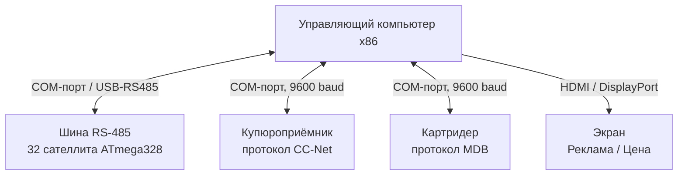
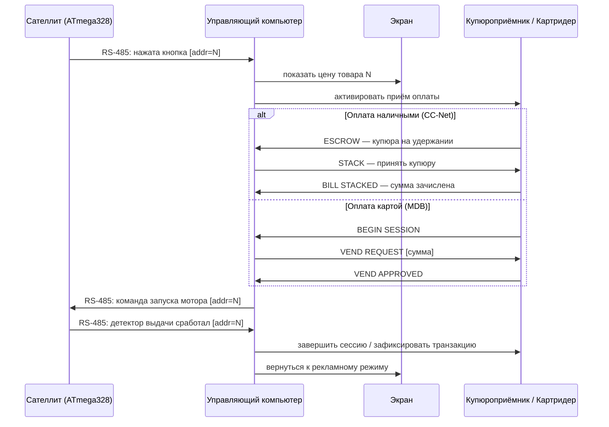
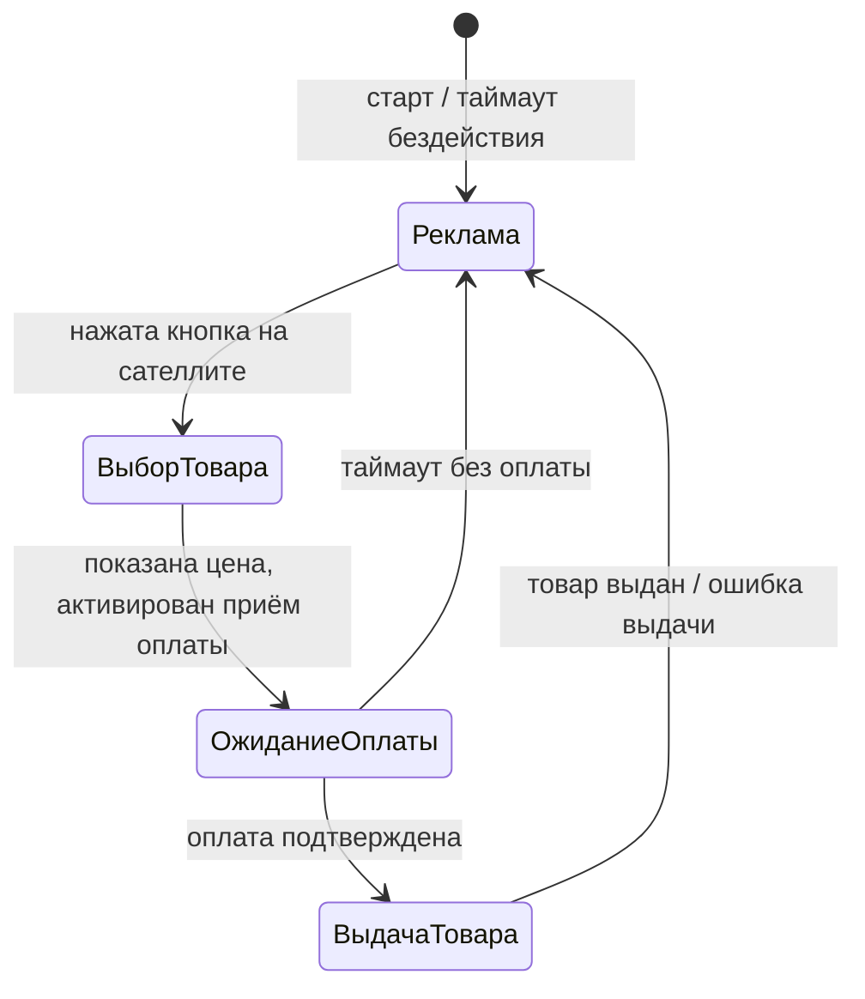
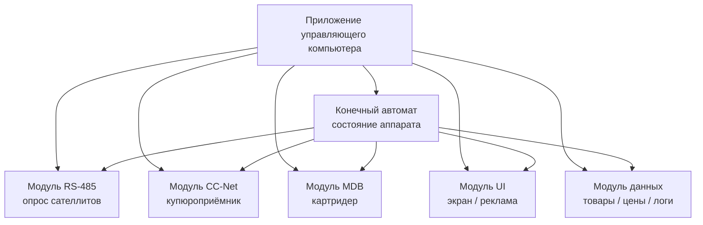

# Требования к управляющему компьютеру

## Общая архитектура

Управляющий компьютер — центральный узел вендингового аппарата. Он координирует все подсистемы: приём оплаты, взаимодействие с сателлитами, отображение рекламы и управление выдачей товара.

---

## Интерфейсы и протоколы

### 1. RS-485 — взаимодействие с сателлитами

- Физический интерфейс: USB→RS-485 конвертер или COM-порт + MAX485
- Протокол: Modbus RTU (см. «общее описание шины данных.md»)
- Скорость: 115200 baud
- Топология: Master (PC) → 32 Slave (ATmega328)
- Данные от сателлита: номер ячейки (адрес DIP), событие нажатия кнопки вызова, событие успешной или неуспешной выдачи
- Команды к сателлиту: выдача товара

### 2. CC-Net — купюроприёмник

- Физический интерфейс: COM-порт (RS-232 или TTL через конвертер)
- Скорость: 9600 baud, 8N1
- Режим работы: PC — Master, купюроприёмник — Slave
- Основные события от устройства:

| Событие | Описание |
|---------|----------|
| `BILL STACKED` | Купюра принята и зачислена |
| `BILL RETURNED` | Купюра отклонена |
| `ESCROW` | Купюра на удержании, ожидает подтверждения |
| `DISABLED` | Устройство отключено |

- Управляющий компьютер подтверждает или отклоняет купюру из ESCROW в зависимости от суммы заказа

### 3. MDB — картридер / безналичная оплата

- Физический интерфейс: COM-порт с уровнями MDB (9-bit, +24V) через конвертер MDB→USB или MDB→RS232
- Скорость: 9600 baud, 9-bit формат
- Режим работы: PC выступает как VMC (Vending Machine Controller)
- Основные команды VMC→картридер:

| Команда | Описание |
|---------|----------|
| `RESET` | Инициализация устройства |
| `SETUP` | Передача конфигурации (валюта, цены) |
| `VEND REQUEST` | Запрос на списание суммы |
| `VEND SUCCESS` | Подтверждение выдачи товара |
| `VEND FAILURE` | Отмена транзакции |
| `SESSION COMPLETE` | Завершение сессии оплаты |

---

## Поток данных при покупке

---

## Требования к экрану

| Режим экрана | Содержимое |
|-------------|------------|
| Реклама | Слайдшоу изображений/видео товаров, цены, акции |
| Выбор товара | Фото товара, название, цена, инструкция по оплате |
| Ожидание оплаты | Сумма к оплате, индикатор принятых средств |
| Выдача товара | Анимация / сообщение «Заберите товар» |
| Ошибка | Сообщение об ошибке, контакты поддержки |

---

## Требования к программному обеспечению

- Все модули работают в отдельных потоках (threads) с очередями событий
- Центральный конечный автомат (FSM) управляет переходами между состояниями
- Логирование всех транзакций и ошибок в локальную БД (SQLite)
- Конфигурация товаров (название, цена, фото, адрес сателлита) — JSON-файл

---

## Требования к аппаратной части PC

| Параметр | Требование |
|----------|-----------|
| Архитектура | x86 / x86-64 |
| ОС | Windows 10 IoT / Linux |
| COM-порты | минимум 3 (RS-485, CC-Net, MDB) |
| Дисплей | HDMI/DP, разрешение от 1280×720 |
| Хранилище | SSD от 32 ГБ (медиаконтент + БД) |
| Питание | 12V DC (промышленный блок питания) |
| Форм-фактор | Mini-ITX или промышленный SBC |
